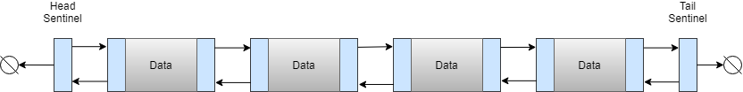

# Linked List Arduino
This is a Doubly Linked List class with head and tail sentinel nodes, which was written using C++ to be used with Arduino sketchs.

 

 

## Getting Started
1. Move the LinkedList folder to your Arduino libraries folder, contained in your sketchbook folder.
2. Use `#include <LinkedList.h>` at the top of your sketch or click Sketch -> Include Library -> LinkedList.

## Functionality
Constructors:
- Default constructor
- Copy constructor

Size Accessor Functions:
- int size
- bool empty

Element Access Functions:
- Type front
- Type back
- Node* begin
- Node* end
- Node* rbegin
- Node* rend

Modifier Functions:
- void push_front
- void push_back
- void pop_front
- void pop_back
- void clear

Misc. Functions:
- void print

## Author
Copyright (c) 2018 Aidan Clyens
